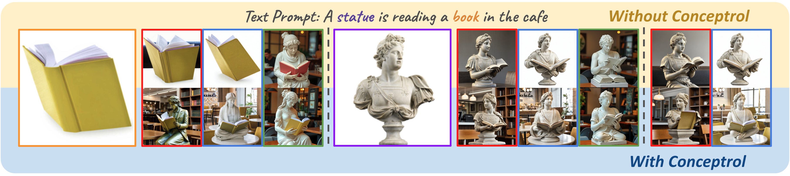

<p align="center">
  
</p>

### <div align="center">Conceptrol: Concept Control of Zero-shot Personalized Image Generation<div>

## 📑 Abstract

<b>TL;DR: <font color="red">Conceptrol</font> </b> is a free lunch that elicits the personalized ability of zero-shot adapter by transforming image condition to visual specification contrained by textual concept, even outperforming fine-tuning methods.

## 🚗 Quick Start

1. Environment Setup

``` bash
conda create -n conceptrol python=3.10
conda activate conceptrol
pip install -r requirements.txt
```

2. Go to `demo_sd.ipynb` / `demo_sdxl.ipynb` / `demo_flux.py` for fun!

## ❤️ Acknowledgement

We thank the following repositories for their great work: 

[diffusers](https://github.com/huggingface/diffusers), 
[transformers](https://github.com/huggingface/transformers), 
[IP-Adapter](https://github.com/tencent-ailab/IP-Adapter), 
[OminiControl](https://github.com/Yuanshi9815/OminiControl)


